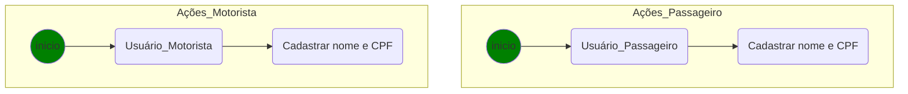

# Estudo_Diagrama_Aplicativo_de_Viagem
Estudo pratico sobre diagramas referente ao curso da plataforma DIO, relembrar métodos, conteúdos e conceitos abordados.

```mermaid
flowchart TD;

    inicio_P((inicio))
    style inicio_P fill:green
    
subgraph Ações_Passageiro

    usuario_P(Usuário_Passageiro)

    cadastrarDados_P(Cadastrar nome e CPF)

  inicio_P-->usuario_P(Usuário_Passageiro)
  usuario_P(Usuário_Passageiro)-->cadastrarDados_P(Cadastrar nome e CPF)
  end


subgraph Ações_Motorista
inicio_M((inicio))
    style inicio_M fill:green
cadastrarDados_M(Cadastrar nome e CPF)
   inicio_M-->usuario_M(Usuário_Motorista)
    usuario_M(Usuário_Motorista)-->cadastrarDados_M(Cadastrar nome e CPF)

end
```
